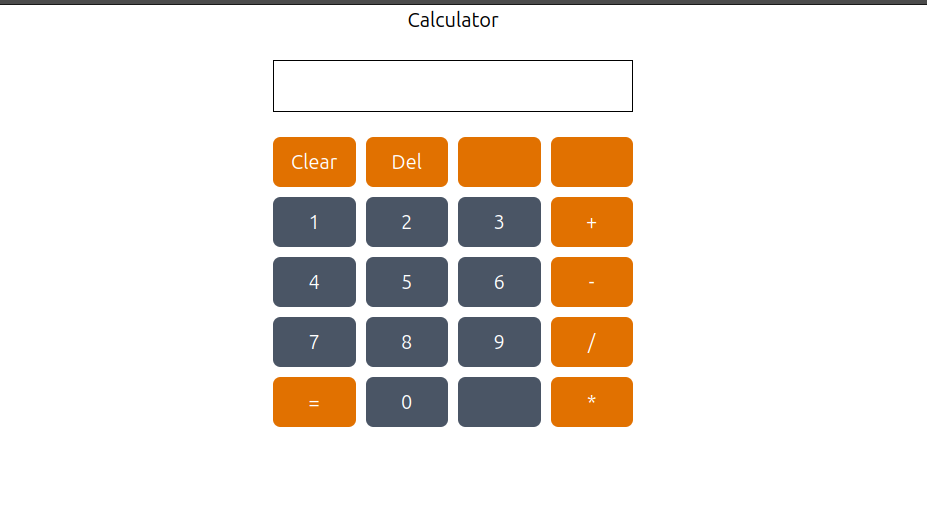
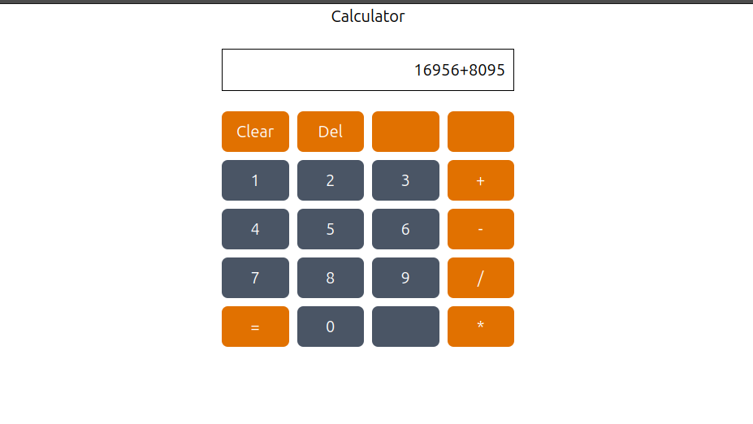
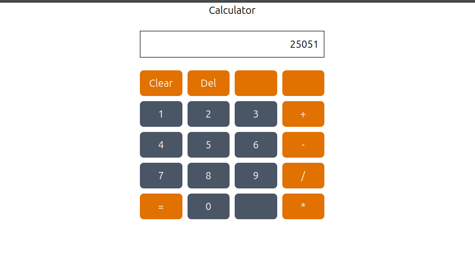

# 🧮 Calculator React App

A modern calculator built with **React.js** that handles basic arithmetic operations. This project demonstrates how to manage user inputs, perform evaluations, and handle UI interactions in a React application.

## 🚀 Features

- ➕ Addition
- ➖ Subtraction
- ✖️ Multiplication
- ➗ Division
- 🧹 Clear screen (AC)
- ⌫ Delete individual digits (DEL)
- ✅ Live expression evaluation
- 🔢 Supports decimal numbers

## 📸 Screenshot








## 🛠️ Built With

- React.js (Functional Components + Hooks)
- JavaScript (ES6+)
- HTML5 & CSS3
- Basic calculator logic using `eval()` or equivalent


## ▶️ Getting Started

Follow the steps below to run the calculator locally:

1. **Clone the repo**

```bash
git clone https://github.com/K-Ravindhar/calculator-react.git
cd calculator-react
```

2. Install dependencies
   
```bash
npm install
```

3. Run project

```bash
npm run dev
```

## Link to review

https://calculator-react-sigma-umber.vercel.app/


